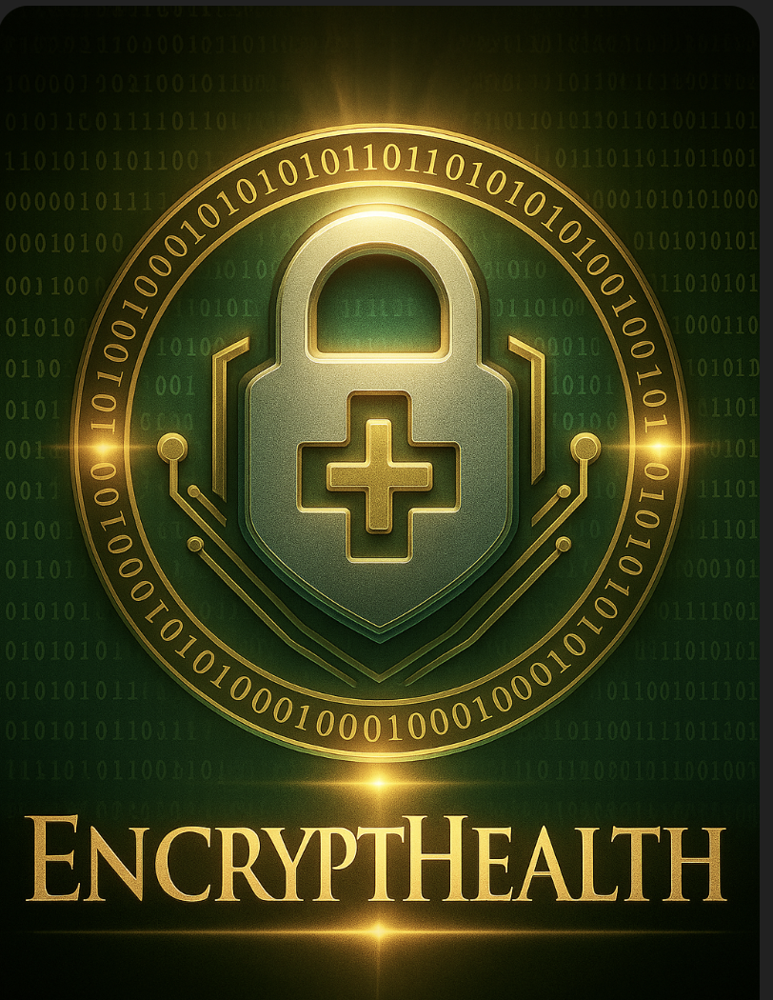
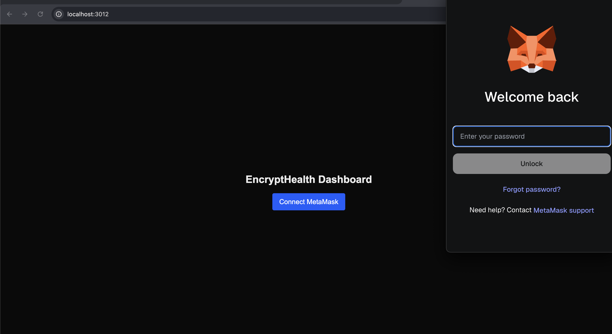
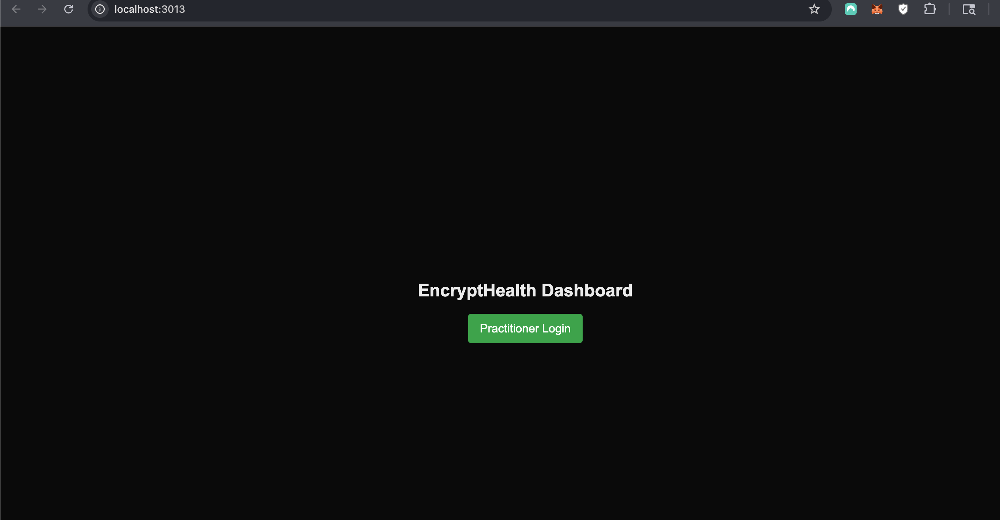
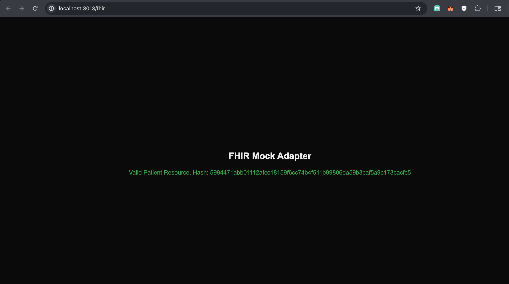
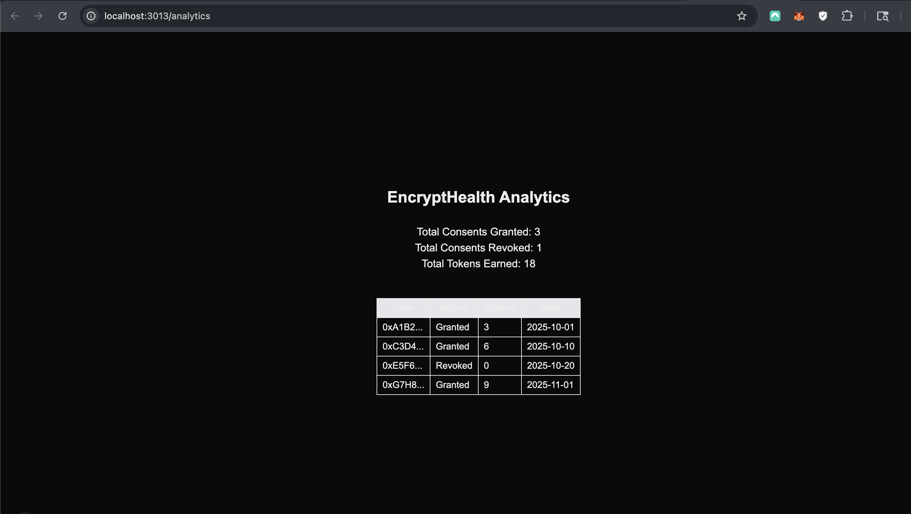

// Rights Reserved, Unlicensed

  

# EncryptHealth — Decentralized Digital Health Ecosystem

**EncryptHealth** is a privacy-first decentralized health data consent and analytics system developed under **Future Systems Lab**.  
It integrates blockchain, FHIR/HL7 interoperability, and DAO governance to create transparent, reward-based data exchange between patients, practitioners, and research organizations.

---

## 🌐 MVP Components

| Module | Description | Demo |
|---------|--------------|------|
| **Frontend Dashboard** | MetaMask user login, practitioner login, and consent toggle linked to the EncryptHealthToken smart contract. |  |
| **Practitioner Login (View 1)** | Practitioner interface for session access. |  |
| **Practitioner Login (View 2)** | Confirmed practitioner authentication state. |  |
| **FHIR/HL7 Adapter** | Parses mock FHIR \`Patient.json\`, verifies structure, and hashes identifiers for secure reference linkage. |  |
| **Analytics Module** | Displays consent history, token rewards, and basic performance summaries. |  |

---

## ⚙️ Architecture Overview

- **Frontend:** Next.js + Tailwind (SSR enabled)  
- **Wallet Integration:** Wagmi / Viem (MetaMask connection)  
- **Blockchain Layer:** ERC-20 (EncryptHealthToken) on Sepolia  
- **Data Adapter:** FHIR/HL7 mock parser for interoperability  
- **Analytics Layer:** Local visualization of consent + token data  
- **Governance Layer (Phase 2):** DAO linkage through token minting  
- **Extensibility (Phase 3):** Optional on-chain registry and audit trail  

✅ Architecture Flow: User → Consent Toggle → FHIR Adapter → EncryptHealthToken → Analytics Summary → DAO Governance (Phase 2 complete)

---

## 🧠 How to Run Locally

cd web
pnpm install
pnpm exec next dev -p 3013

Then open:

* Dashboard → http://localhost:3013  
* FHIR Adapter → http://localhost:3013/fhir  
* Analytics → http://localhost:3013/analytics  

---

## 🪙 Smart Contract Integration

**EncryptHealthToken (ERC-20)**  
Network: Sepolia  
Address: 0xC11F23eC3A64FBA5C47b3F3d5D2a3B987A7bE4b7  

Functions:

* balanceOf(address) — retrieves user balance  
* mint(address,uint256) — mints reward tokens upon consent grant  

Each consent action in the dashboard triggers an on-chain mint for compliant activity tracking.

---

## 🧩 System Design

| Layer         | Technology            | Function                    |
| ------------- | --------------------- | --------------------------- |
| UI / SSR      | Next.js 14 + Tailwind | App rendering & routing     |
| State / Query | React Query           | Client-side data caching    |
| Wallets       | Wagmi v2 + MetaMask   | Auth & EIP-1193 provider    |
| Blockchain    | Viem                  | Contract reads & writes     |
| Standards     | HL7 FHIR R4           | Healthcare data structure   |
| Security      | SHA-256 Hashing       | Patient ID pseudonymization |

---

## 📍 Roadmap

- ✅ Phase 1 — EncryptHealth MVP complete (functional consent, FHIR adapter, analytics, DAO link)  
- ⬜ Phase 2 — Commercial expansion / integration layer (branding, partner onboarding, real FHIR data)  
- ⬜ Phase 3 — Decentralized consent registry + on-chain audit trail

---

## 🧭 Future Integration & Potential

* On-chain consent registry storing hashed consents  
* ConsentUpdated event logging for verifiable audit trails  
* Integration with DID/VC credential flows (OIDC4VP)  
* Direct interoperability with external FHIR APIs  
* Replace patient.json with a live FHIR API  
* Extend the consent toggle to map to organization-specific permissions  
* Plug in existing ERC-20 or NFT-based incentive tokens  
* Optional DAO layer for governance and access control  

This phase activates once external wellness or healthcare partners connect live datasets and user wallets.

---

## 📊 Related Projects Under Future Systems Lab

| Project | Focus | Status |
|----------|--------|--------|
| [**HypnoNeuro**](https://github.com/Future-Systems-Lab/HypnoNeuro) | Gamified mental wellness + DAO ecosystem with non-PHI credential flows | ✅ MVP Complete |
| [**Secure Health Login**](https://github.com/Future-Systems-Lab/secure-health-login) | Wallet-based FHIR login portal (Next.js + Wagmi) | ✅ Operational |
| [**Future Systems Lab Core**](https://github.com/Future-Systems-Lab) | Framework for building modular digital-health systems and components | 🟢 Active |

---

## 🧩 Interoperability Standards

* HL7 FHIR R4 data format  
* EIP-712 typed messages for structured wallet signing  
* EIP-4337 (Account Abstraction) planned  
* OIDC4VP + DID Consent Models planned  
* W3C VC/VP extensions for verifiable health credentials  

---

## 🧾 Contract Summary

| Contract                | Network | Type    | Purpose                       |
| ----------------------- | ------- | ------- | ----------------------------- |
| **EncryptHealthToken**  | Sepolia | ERC-20  | Reward + governance token     |
| **MindMasteryNFT**      | Sepolia | ERC-721 | Tiered credential NFT (L1–L3) |
| **HypnoNeuroNFT_L1_L3** | Sepolia | ERC-721 | Therapy progression NFTs      |

---

## 🧬 Compliance and Governance

* No PHI stored on-chain; only hashed identifiers  
* FHIR R4 structure ensures interoperability with EHR systems  
* Consent toggle model supports HIPAA and GDPR alignment  
* DID/VC integration planned for decentralized consent verification  
* DAO governance ensures transparency in reward distribution  

---

## 🧩 Ecosystem Summary

| Layer      | Component                 | Function                    |
| ---------- | ------------------------- | --------------------------- |
| Identity   | MetaMask / Wallet Connect | Secure user auth            |
| Data       | HL7 FHIR JSON             | Interoperable clinical data |
| Blockchain | Sepolia (EVM)             | Consent + Reward storage    |
| Analytics  | Next.js Charts + Tables   | Transparency & insights     |
| DAO        | EHT Token + NFTs          | Governance + engagement     |

---

## 🎥 DAO Presentation

[View DAO Presentation (PDF)](docs/DAO_Presentation.pdf)

---

| EncryptHealthToken (EHT) |
|---------------------------|
|  |

© Future Systems Lab | Where Mental Wellness Meets Metaverse | Rights Reserved, Unlicensed

